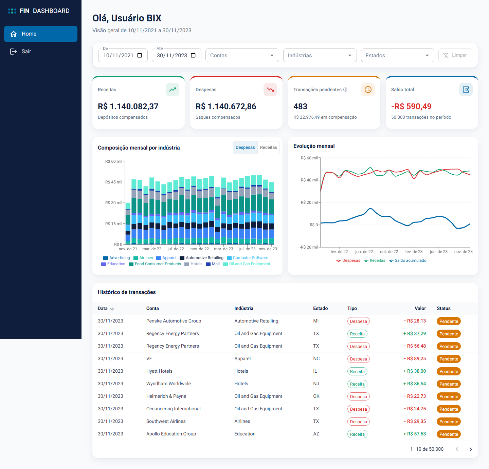
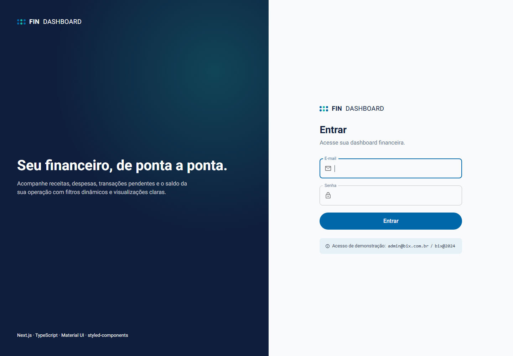
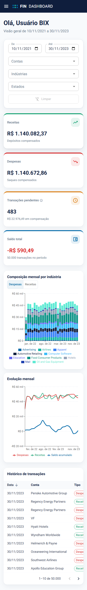

<div align="center">

# 📊 Dashboard Financeiro

**Análise de receitas, despesas, saldo e transações pendentes sobre 50 mil transações, com filtros dinâmicos, gráficos e histórico paginado.**

[](https://github.com/FlaviaMMartini/dashboard-financeiro/actions/workflows/ci.yml)
[](jest.config.ts)
[](e2e/dashboard.spec.ts)
[](https://www.conventionalcommits.org)
[](.prettierrc.json)

[](https://nextjs.org)
[](https://react.dev)
[](tsconfig.json)
[](https://mui.com)
[](https://styled-components.com)
[](https://zod.dev)

[](https://vercel.com/new/clone?repository-url=https%3A%2F%2Fgithub.com%2FFlaviaMMartini%2Fdashboard-financeiro&env=SESSION_SECRET&envDescription=Segredo%20de%20no%20m%C3%ADnimo%2032%20caracteres%20para%20assinar%20o%20cookie%20de%20sess%C3%A3o&project-name=dashboard-financeiro)



</div>

## Sumário

- [Sobre o projeto](#sobre-o-projeto)
- [Como rodar em 1 minuto](#como-rodar-em-1-minuto)
- [Stack](#stack)
- [Funcionalidades](#funcionalidades)
- [Arquitetura](#arquitetura)
- [Decisões técnicas (ADRs)](#decisões-técnicas-adrs)
- [Qualidade e testes](#qualidade-e-testes)
- [Scripts e configuração](#scripts-e-configuração)
- [Deploy](#deploy)

## Sobre o projeto

Dashboard financeira desenvolvida como desafio técnico de front-end. O usuário faz login e acessa uma dashboard protegida. Nela, filtra as transações por **período, contas, indústrias e estados** e todo o conteúdo se atualiza a partir dos filtros: cards de resumo, gráfico de barras empilhadas, gráfico de linhas e histórico paginado.

A fonte de dados é o arquivo `transactions.json` fornecido no desafio (**50.000 transações, 11,7 MB**), mantido **sem nenhuma alteração** (um teste confere o hash SHA-256). Os dados são processados **no servidor**, com cache do Next.js, e o navegador recebe apenas alguns KB já agregados.

A identidade visual segue a da BIX Tecnologia: azul `#0068A8`, azul-marinho `#0F1E3D`, texto `#334155` e fonte Roboto.

| Login                                        | Mobile                                                        |
| -------------------------------------------- | ------------------------------------------------------------- |
|  |  |

## Como rodar em 1 minuto

> Requisitos: **Node.js 20.9 ou superior** (recomendado: 24, fixado em `.nvmrc`) e **npm**.

```bash
git clone https://github.com/FlaviaMMartini/dashboard-financeiro.git
cd dashboard-financeiro
npm install
npm run dev
```

Abra **http://localhost:3000** e entre com a conta de demonstração:

| E-mail             | Senha      |
| ------------------ | ---------- |
| `admin@bix.com.br` | `bix@2024` |

Em desenvolvimento nenhuma configuração é necessária.

<details>
<summary><strong>Rodar o build de produção</strong></summary>

Em produção, `SESSION_SECRET` é obrigatório (mínimo de 32 caracteres). O `.env.example` já traz um valor de exemplo:

```bash
cp .env.example .env.local
npm run build
npm start
```

Para gerar um segredo próprio:

```bash
node -e "console.log(require('crypto').randomBytes(32).toString('hex'))"
```

</details>

<details>
<summary><strong>Rodar os testes</strong></summary>

```bash
npm run test:coverage                # unitários + componentes, com cobertura (mínimo 100%)
npx playwright install chromium      # apenas na primeira vez
npm run test:e2e                     # E2E em desktop e mobile, contra o build de produção
```

</details>

## Stack

| Camada       | Tecnologia                                                                                                            |
| ------------ | --------------------------------------------------------------------------------------------------------------------- |
| Framework    | **Next.js 16** (App Router, Server Components, Server Actions, Cache Components, Partial Prerendering) + **React 19** |
| Linguagem    | **TypeScript** em modo estrito (`noUncheckedIndexedAccess`)                                                           |
| Componentes  | **Material UI 9** com a integração oficial para o App Router                                                          |
| Estilização  | **styled-components 6**, com tema único compartilhado com o MUI                                                       |
| Gráficos     | **Recharts** (SVG)                                                                                                    |
| Validação    | **Zod 4** (dataset, search params, formulário e variáveis de ambiente)                                                |
| Autenticação | JWT HS256 com **jose**, em cookie `HttpOnly`                                                                          |
| Testes       | **Jest** + **Testing Library** (unitários e componentes) e **Playwright** (E2E)                                       |
| Qualidade    | ESLint, Prettier, Husky, lint-staged, commitlint                                                                      |
| CI           | GitHub Actions                                                                                                        |

## Funcionalidades

- 🔐 **Login e dashboard protegida.** O proxy (`src/proxy.ts`) bloqueia as rotas sem sessão, e a página valida a sessão de novo antes de ler os dados.
- 🎛️ **Filtros globais e dinâmicos** por período, contas, indústrias e estados. Cards, gráficos e tabela são recalculados a partir deles.
- 🔗 **Filtros em cascata.** Selecionar uma indústria ou um estado restringe as contas disponíveis, e vice-versa. Os valores já selecionados continuam na lista para poderem ser desmarcados.
- 💳 **Cards** de receitas, despesas, transações pendentes e saldo total.
- 📊 **Gráfico de barras empilhadas** com a composição mensal por indústria, alternando entre despesas e receitas.
- 📈 **Gráfico de linhas** com receitas, despesas e saldo acumulado por mês.
- 📋 **Histórico de transações** com paginação e ordenação no servidor.
- 🧭 **Sidebar exclusiva da dashboard** com Home e Sair. No mobile, vira um menu lateral.
- 💾 **Sessão e filtros persistidos sem banco de dados**, na URL e em cookies.
- 📱 **Responsivo**, de 320px a telas largas, com skeletons de carregamento, estados vazios e tela de erro com "Tentar novamente".
- ♿ **Acessível**: controles rotulados, `aria-sort` na tabela, descrições textuais nos gráficos e navegação por teclado.

## Arquitetura

```
data/transactions.json            # dataset original, intocado (hash verificado em teste)
src/
├─ app/                           # rotas: /login e /dashboard (layout, page, loading, error)
├─ proxy.ts                       # autenticação + persistência e restauração dos filtros
├─ domain/                        # regras de negócio puras (sem React, sem Next)
│  ├─ transaction.ts              # schema Zod do dataset + normalização
│  ├─ filters.ts                  # parse/serialize da URL e aplicação dos filtros
│  ├─ filter-options.ts           # opções em cascata
│  ├─ aggregations.ts             # resumo, série mensal e composição por indústria
│  ├─ pending.ts                  # regra de pendentes (ADR-001)
│  ├─ table.ts                    # paginação e ordenação
│  └─ money.ts · dates.ts         # formatação pt-BR, sempre em UTC
├─ server/                        # somente servidor (`server-only`)
│  ├─ transactions-repository.ts  # lê e valida o JSON uma vez por processo
│  ├─ dashboard-service.ts        # agregação com `'use cache'`
│  └─ env.ts                      # variáveis de ambiente validadas com Zod
├─ features/
│  ├─ auth/                       # sessão, Server Actions e formulário de login
│  └─ dashboard/                  # shell, filtros, cards, gráficos e tabela
└─ styles/                        # tema único, providers e registry de SSR
```

**Fluxo de uma requisição:**

```
URL (/dashboard?states=TX&from=…)
  → proxy.ts           valida a sessão e salva os filtros em cookie
  → page.tsx           Server Component: faz o parse dos search params com Zod
  → dashboard-service  getDashboardOverview + getTransactionsPage, em paralelo e em cache
  → DashboardView      Client Component: interações alteram a URL (router.push em transition)
```

## Decisões técnicas (ADRs)

<details open>
<summary><strong>ADR-001: Regra de "transações pendentes"</strong></summary>

O dataset não tem campo de status. Adotamos como "hoje" a **data da transação mais recente do dataset (30/11/2023)**. Transações dos **7 dias anteriores** a essa data são consideradas **pendentes de compensação**:

- aparecem no card "Transações pendentes" (quantidade e volume);
- **não** entram em receitas, despesas nem saldo;
- são marcadas como "Pendente" na tabela.

A regra fica numa função pura (`src/domain/pending.ts`) e é explicada em um tooltip no card.

</details>

<details>
<summary><strong>ADR-002: Agregação no servidor, cache em duas partes e paginação</strong></summary>

O `transactions.json` (50 mil registros, 11,7 MB) **nunca é enviado ao navegador**. O repositório lê e valida o arquivo com Zod uma única vez por processo.

O cache usa `'use cache'` (Cache Components), com `cacheLife('hours')` e `cacheTag('transactions')`. Os argumentos de uma função com `'use cache'` formam a chave do cache, por isso ele fica **dividido em duas funções**, buscadas em paralelo:

| Função                                      | Chave do cache               | Conteúdo                            |
| ------------------------------------------- | ---------------------------- | ----------------------------------- |
| `getDashboardOverview(filters)`             | filtros                      | cards, gráficos, opções dos selects |
| `getTransactionsPage(filters, tableParams)` | filtros + página + ordenação | 10 linhas da tabela                 |

Trocar de página ou reordenar a tabela **não recalcula cards e gráficos**. Com Cache Components, `/dashboard` usa **Partial Prerendering**: o shell (sidebar e skeleton) é estático e os dados chegam por streaming.

**Paginação em vez de rolagem infinita:** a tabela mostra sempre ~10 linhas, com memória constante no navegador. A posição fica na URL (`?page=37`), então dá para compartilhar o link, o voltar do navegador funciona e a página sobrevive ao F5, que é o que um histórico financeiro, usado para conferência, precisa. A rolagem infinita acumula linhas na tela, exigiria virtualizar a lista e perderia a posição ao recarregar. Com um banco de dados real, a paginação por número de página daria lugar à paginação por cursor (keyset).

</details>

<details>
<summary><strong>ADR-003: A URL como fonte de verdade e persistência sem banco</strong></summary>

- Filtros, página e ordenação vivem na **URL**: dá para compartilhar links, o voltar/avançar funciona e o servidor renderiza sem estado duplicado no cliente.
- Search params são **não confiáveis**: o schema Zod descarta valores inválidos e inverte intervalos de data trocados.
- O `proxy.ts` grava o último estado válido (já saneado) em um cookie `HttpOnly`. Ao abrir `/dashboard` sem query, o estado é restaurado.

</details>

<details>
<summary><strong>ADR-004: Sessão sem banco de dados</strong></summary>

Sessão em **JWT HS256 (`jose`) num cookie `HttpOnly`, `SameSite=Lax` e `Secure` em produção**, com validade de 8 horas.

- O login é uma **Server Action**, e o mesmo schema Zod valida o formulário no cliente e no servidor.
- Credenciais comparadas com `timingSafeEqual` e mensagem de erro genérica, sem revelar se o e-mail existe.
- Proteção contra open redirect no parâmetro `?from=`.

</details>

<details>
<summary><strong>ADR-005: Material UI + styled-components</strong></summary>

- **Material UI** fornece componentes acessíveis e maduros, com seu motor padrão (Emotion) e a integração oficial para o App Router. O motor alternativo de styled-components do MUI tem problemas conhecidos de SSR.
- **styled-components** faz toda a estilização da aplicação: layout, grids responsivos, cards, tooltip dos gráficos e overrides visuais dos componentes MUI.
- Os dois leem os **mesmos tokens** de `src/styles/theme.ts`. Nenhuma cor fica hardcoded nos componentes.
- O projeto começou com Ant Design, que foi substituído porque o registry de SSR do antd usa `Math.random()`, incompatível com Cache Components.

</details>

<details>
<summary><strong>ADR-006: Recharts para os gráficos</strong></summary>

Recharts gera SVG composável e leve. O tooltip é um componente próprio: ordena por valor, omite itens zerados e mostra o total nas barras empilhadas. Cada gráfico tem descrição textual acessível (`role="figure"`) e estado vazio.

</details>

## Qualidade e testes

| Verificação             | Ferramenta                         | Onde roda                      |
| ----------------------- | ---------------------------------- | ------------------------------ |
| Formatação              | Prettier                           | pre-commit (lint-staged) e CI  |
| Lint                    | ESLint (Next, TypeScript, imports) | pre-commit e CI                |
| Tipos                   | `tsc --noEmit` em modo estrito     | CI                             |
| Mensagens de commit     | commitlint (Conventional Commits)  | hook `commit-msg`              |
| Unitários e componentes | Jest + Testing Library             | CI, **falha abaixo de 100%**   |
| Ponta a ponta           | Playwright (desktop + mobile)      | CI, contra o build de produção |

**O que os testes cobrem:**

- **Domínio:** funções puras e casos de borda (fuso horário, limites inclusivos de data, listas vazias, saldo negativo, cascata de filtros).
- **Servidor:** sessão (expirada, adulterada, payload inválido), Server Actions, proxy, chaves do cache e validação das variáveis de ambiente.
- **Componentes:** renderizados com os providers reais, com interações via `user-event` e consultas por papel ARIA.
- **Integridade:** o hash **SHA-256 do `transactions.json`** garante que o arquivo original não foi alterado.
- **E2E:** redirecionamento com retorno à origem após o login, erro de credenciais, filtros persistindo após recarregar e logout.

## Scripts e configuração

| Script                            | O que faz                             |
| --------------------------------- | ------------------------------------- |
| `npm run dev`                     | Servidor de desenvolvimento           |
| `npm run build` · `npm start`     | Build e servidor de produção          |
| `npm run lint`                    | ESLint                                |
| `npm run typecheck`               | Checagem de tipos                     |
| `npm run format` · `format:check` | Prettier                              |
| `npm test` · `test:watch`         | Testes unitários e de componentes     |
| `npm run test:coverage`           | Testes com cobertura (mínimo de 100%) |
| `npm run test:e2e`                | Testes E2E com Playwright             |

| Variável             | Padrão                                 | Descrição                             |
| -------------------- | -------------------------------------- | ------------------------------------- |
| `SESSION_SECRET`     | valor de dev (apenas fora de produção) | Segredo que assina o cookie de sessão |
| `DEMO_USER_NAME`     | `Usuário BIX`                          | Nome exibido na dashboard             |
| `DEMO_USER_EMAIL`    | `admin@bix.com.br`                     | E-mail da conta de demonstração       |
| `DEMO_USER_PASSWORD` | `bix@2024`                             | Senha da conta de demonstração        |

## Deploy

**Vercel (recomendado):** clique em **Deploy with Vercel** no topo desta página e informe um `SESSION_SECRET` com pelo menos 32 caracteres. O dataset é incluído no bundle serverless via `outputFileTracingIncludes` em `next.config.ts`.

**Qualquer ambiente Node.js:**

```bash
npm ci
npm run build
SESSION_SECRET=<segredo-com-32-caracteres-ou-mais> npm start
```

---

<div align="center">

Desenvolvido por [@FlaviaMMartini](https://github.com/FlaviaMMartini)

</div>
